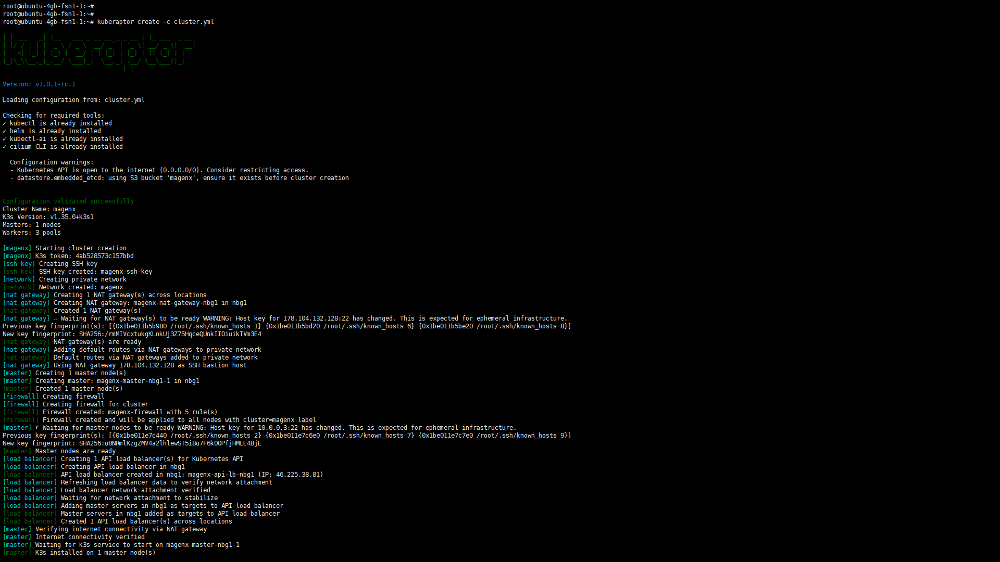
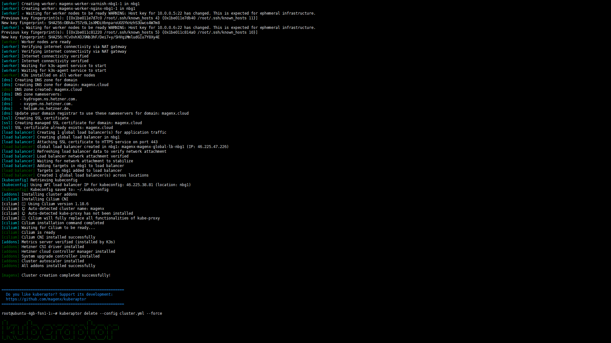

## Kuberaptor - [Hetzner](https://hetzner.cloud/?ref=RjVtLXq3rlEz) K3s Cluster
> [kube`raptor]

  

## 🎉 Project Status: **WIP**
### An independent open source project, not affiliated with [Hetzner](https://hetzner.cloud/?ref=RjVtLXq3rlEz) Online GmbH.
The Kuberaptor project is a Kubernetes cluster management tool written in Go, providing automated cluster creation, management, and operations on [Hetzner](https://hetzner.cloud/?ref=RjVtLXq3rlEz) Cloud infrastructure.  

📚 **[Documentation overview](https://deepwiki.com/magenx/kuberaptor)**  
**[Website](https://www.kuberaptor.com/)**   
**[Linkedin](https://www.linkedin.com/pulse/kuberaptor-production-ready-k3s-clusters-denis-z%25C3%25B5kov-903kf)**   

---

## 📊 Project Statistics

| Metric | Value | Description |
|--------|-------|-------------|
| **Language** | **Go 1.26** | Modern, efficient, compiled language |
| **Startup Time** | **<10ms** | Instant binary startup |
| **Binary Size** | **~12MB** | Compact single executable |
| **Build Time** | **~20 sec** | Fast development iteration |
| **Dependencies** | **Static binary** | Zero runtime dependencies |
| **Test Coverage** | **Comprehensive** | Unit and integration tests included |
| **Configuration** | **YAML** | Full syntax support |
---

## ✅ Core Features

### Cluster Operations

**1. Cluster Creation** ✅
- Multi-master high availability with embedded etcd
- Private network provisioning and configuration
- Multiple worker pools with custom labels and taints
- Placement groups for high availability (spread servers across physical hosts)
- Automated SSH key management
- K3s installation using official installation script
- Load balancer creation for Kubernetes API access
- Automated firewall configuration
- Kubeconfig retrieval and local save
- Comprehensive progress logging

**2. Cluster Upgrade** ✅
- System-upgrade-controller integration
- Rolling upgrades with configurable concurrency
  - Masters: 1 node at a time for stability
  - Workers: 2 nodes at a time for efficiency
- Automated upgrade plan generation
- Post-upgrade health checks
- Node cordoning during upgrades
- Real-time progress monitoring

**3. Cluster Deletion** ✅
- Complete resource cleanup
- Removes all associated resources:
  - Servers (masters and workers)
  - Private networks
  - Load balancers
  - Firewalls
  - SSH keys
  - Placement groups
- Label-based resource discovery
- Safe deletion with confirmation

**4. Command Execution** ✅
- Parallel command execution across cluster nodes
- Goroutine-based concurrency for performance
- Synchronized execution with sync.WaitGroup
- Script file execution support
- Per-node output display with clear formatting
- Success/failure tracking per node

**5. Release Management** ✅
- K3s version fetching from GitHub API
- Intelligent 7-day caching mechanism
- Pagination support for large release lists
- Version filtering and display

### Infrastructure Components

**1. [Hetzner](https://hetzner.cloud/?ref=RjVtLXq3rlEz) Cloud Integration** ✅
- Official [Hetzner](https://hetzner.cloud/?ref=RjVtLXq3rlEz) Cloud Go SDK v2 integration
- Complete server lifecycle management
- Network management (creation, deletion, configuration)
- Firewall management with rule configuration
- Load balancer management with health checks
- Placement group management for high availability
- SSH key management
- Location and instance type queries
- Action waiting and status verification

**2. Configuration System** ✅
- Complete YAML configuration model
- Configuration loader with intelligent defaults
- Path expansion for SSH keys and kubeconfig
- Comprehensive validation framework
- Environment variable support
- Schema validation

**3. Cloud-Init Integration** ✅
- Template-based cloud-init generation
- Master and worker node initialization
- Network configuration
- K3s installation automation

**4. Add-ons Management** ✅
- Hetzner Cloud Controller Manager
- Hetzner CSI Driver
- System Upgrade Controller
- Cluster Autoscaler support
- Cilium CNI (optional alternative to Flannel)

**5. Utilities** ✅
- SSH client with connection pooling
- Command execution and file transfer
- Server readiness checks
- Shell execution with output streaming
- File operations (SSH keys, kubeconfig)
- Logging utilities with configurable levels
- Retry logic with exponential backoff

### Network Security

**1. Load Balancer** ✅
- Kubernetes API load balancer creation
- Global load balancer for application traffic
- HTTPS/TLS support with managed SSL certificates
- Automatic master node targeting
- TCP health checks (15s interval, 10s timeout, 3 retries)
- Public IPv4/IPv6 support
- Automatic DNS configuration
- Cluster-specific labeling

**2. SSL Certificates** ✅
- Managed SSL certificate creation via Hetzner
- Automatic DNS validation using Hetzner DNS zones
- Root domain and wildcard subdomain coverage (example.com and *.example.com)
- Automatic attachment to HTTPS load balancer services
- Background certificate issuance (up to 5 minutes)
- Certificate lifecycle management (create/delete)
- Certificate preservation option to avoid Let's Encrypt rate limits during cluster recreation

**3. DNS Zone Management** ✅
- Automated DNS zone creation in Hetzner DNS
- Configurable TTL values
- Nameserver information display
- Integration with SSL certificate validation
- Cluster-specific zone labeling

**4. Firewall** ✅
- SSH access control from configured networks
- API access control from configured networks
- Full internal network communication (TCP/UDP/ICMP)
- CIDR notation support and validation
- Automatic security rule generation
- Dynamic rule updates

**5. Release Management** ✅
- K3s version fetching from GitHub API
- Intelligent 7-day caching mechanism
- Pagination support for large release lists
- Version filtering and display

---

## 🏗️ Architecture

### Project Structure
```
kuberaptor/
├── cmd/kuberaptor/              # CLI application entry point
│   ├── main.go                   # Application initialization
│   └── commands/                 # Cobra CLI commands
│       ├── root.go               # Root command and global flags
│       ├── create.go             # Cluster creation command
│       ├── delete.go             # Cluster deletion command
│       ├── upgrade.go            # Cluster upgrade command
│       ├── run.go                # Command execution on nodes
│       ├── releases.go           # K3s release listing
│       ├── budget.go             # Cluster cost estimation
│       ├── config.go             # Configuration file generator
│       └── completion.go         # Shell completion generation
│
├── internal/                     # Private application code
│   ├── cluster/                  # Cluster operations (core logic)
│   │   ├── create_enhanced.go    # Cluster creation
│   │   ├── delete.go             # Cluster deletion
│   │   ├── upgrade_enhanced.go   # Cluster upgrades
│   │   ├── run_enhanced.go       # Parallel command execution
│   │   ├── network_resources.go  # Load balancer & firewall
│   │   ├── budget.go             # Cost estimation logic
│   │   └── helpers.go            # Shared helper functions
│   │
│   ├── config/                   # Configuration management
│   │   ├── main.go               # Main configuration structure
│   │   ├── loader.go             # Configuration file loader
│   │   ├── validator.go          # Configuration validation
│   │   ├── generator.go          # Sample config generation
│   │   ├── networking.go         # Network configuration
│   │   ├── node_pool.go          # Node pool configuration
│   │   ├── load_balancer.go      # Load balancer configuration
│   │   ├── dns_zone.go           # DNS zone configuration
│   │   ├── ssl_certificate.go    # SSL certificate configuration
│   │   ├── api_load_balancer.go  # API load balancer configuration
│   │   └── datastore_addons.go   # Datastore and addon configs
│   │
│   ├── cloudinit/                # Cloud-init template generation
│   │   └── generator.go          # Template rendering for nodes
│   │
│   ├── addons/                   # Kubernetes addon management
│   │   ├── installer.go          # Addon installation orchestration
│   │   ├── csi_driver.go         # Hetzner CSI driver
│   │   ├── cloud_controller_manager.go  # Hetzner CCM
│   │   ├── system_upgrade_controller.go # Upgrade controller
│   │   ├── cluster_autoscaler.go # Cluster autoscaler
│   │   └── cilium.go             # Cilium CNI addon
│   │
│   └── util/                     # Utility functions
│       ├── ssh.go                # SSH client implementation
│       ├── shell.go              # Shell command execution
│       ├── file.go               # File operations
│       ├── kubectl.go            # kubectl helper
│       ├── progress.go           # Progress reporting
│       ├── progress_reporter.go  # Progress reporter abstraction
│       └── toolinstaller.go      # Tool installation helpers
│
└── pkg/                          # Public reusable libraries
    ├── hetzner/                  # Hetzner Cloud API wrapper
    │   └── client.go             # Complete API client
    │
    ├── k3s/                      # K3s operations
    │   └── k3s.go                # Release fetcher, token generation
    │
    ├── templates/                # Template rendering
    │   └── templates.go          # Go template system
    │
    └── version/                  # Version information
        └── version.go            # Build-time version injection
```

### Key Design Principles

1. **Modularity**: Clear separation between CLI, business logic, and infrastructure
2. **Concurrency**: Goroutines for parallel operations and performance
3. **Error Handling**: Explicit error returns and comprehensive error messages
4. **Type Safety**: Strong typing throughout with interfaces for abstraction
5. **Testability**: Unit and integration tests with clear boundaries
6. **Configuration**: YAML-based with validation and defaults

---

## 🎯 CLI Commands

All commands support both configuration files and command-line flags.

| Command | Description | Status |
|---------|-------------|--------|
| `create` | Create a new Kubernetes cluster on Hetzner Cloud | Ready |
| `delete` | Delete an existing cluster and all resources | Ready |
| `upgrade` | Upgrade cluster to a new k3s version | Ready |
| `run` | Execute commands or scripts on cluster nodes | Ready |
| `releases` | List available k3s versions from GitHub | Ready |
| `budget` | Show estimated monthly cost of cluster resources | Ready |
| `config` | Generate sample configuration file | Ready |
| `version` | Display application version information | Ready |
| `completion` | Generate shell completion scripts | Ready |

### Global Flags

- `--config` - Path to configuration file (YAML)
- `--verbose` - Enable verbose logging
- `--help` - Display help information

---

## 🚀 Usage Examples

### 1. Generate Configuration File

Before creating a cluster, generate a sample configuration file:

```bash
# Generate sample configuration in current directory
kuberaptor config --generate

# Generate with custom output path
kuberaptor config --generate --output my-cluster.yaml

# Short form
kuberaptor config -g -o my-cluster.yaml
```

This creates a fully documented YAML configuration file with sensible defaults that you can customize for your cluster.

### 2. Create Cluster | Advaced full config

**Configuration File (cluster.yaml):**

```yaml
# Hetzner Cloud API Token
hetzner_token: <your_hetzner_cloud_token_here>

# Cluster Configuration
# Configuration also supports YAML anchors

cluster_name: &cluster_name mykubic # Cluster name with yaml anchor
kubeconfig_path: ~/.kube/config
k3s_version: v1.35.3+k3s1

domain: &domain example.com   # Optional: Required for DNS zone and SSL certificate (&domain yaml anchor)
locations: &locations         # Optional: &locations yaml anchor
  - nbg1

image: &image debian-13       # Optional: node OS image with &image yaml anchor
autoscaling_image: *image     # Optional: autoscaler node OS image with *image yaml anchor

# Advanced Cluster Settings (Optional)
# Global protection parameter - if true: all resources deletion protection enabled in Hetzner and local cluster delete command
protect_against_deletion: true                    # Prevent accidental deletion (default: true)
schedule_workloads_on_masters: false              # Allow workloads on master nodes (default: false)
include_instance_type_in_instance_name: false     # Include instance type in names (default: false)
k3s_upgrade_concurrency: 1                        # Number of nodes to upgrade in parallel (default: 1)
grow_root_partition_automatically: true           # Auto-grow root partition (default: true)

# API Load Balancer Configuration (Optional)
api_server_hostname: api.example.com              # Custom API server hostname
api_load_balancer:
  enabled: true                                   # Create load balancer for Kubernetes API (default: false)
  hetzner:                                        # Extra Hetzner Cloud metadata labels (optional) Default cluster labels always applied
    labels:
      - key: cluster_id
        value: "123456"
      - key: environment
        value: production

datastore:
  mode: "etcd"
  embedded_etcd:
    snapshot_retention: 24
    snapshot_schedule_cron: "0 * * * *"
    s3_enabled: true
    s3_endpoint: "nbg1.your-objectstorage.com"
    s3_region: nbg1
    s3_bucket: *cluster_name                     # S3 bucket name as cluster name yaml anchor
    s3_folder: "etcd-snapshot"
    s3_access_key: "xxx"                         # your hetzner s3 storage keys
    s3_secret_key: "xxx"                         # your hetzner s3 storage keys

# Networking Configuration
networking:
  # CNI Configuration (Optional - defaults to Flannel)
  cni:
    enabled: false                      # Set to true to use custom CNI (default: false, uses Flannel)
    mode: flannel                       # Options: flannel, cilium
    cilium:                             # Cilium-specific configuration
      enabled: true                     # Enable Cilium CNI
      version: "v1.19.2"                # Cilium version
      encryption_type: wireguard        # Options: wireguard, ipsec
      routing_mode: tunnel              # Options: tunnel, native
      tunnel_protocol: vxlan            # Options: vxlan, geneve
      hubble_enabled: true              # Enable Hubble observability
      hubble_relay_enabled: true
      hubble_ui_enabled: true
      k8s_service_host: 127.0.0.1
      k8s_service_port: 6444
      operator_replicas: 1
      operator_memory_request: 128Mi
      agent_memory_request: 512Mi
      egress_gateway_enabled: false
      hubble_metrics:
        - dns
        - drop
        - tcp
        - flow
        - port-distribution
        - icmp
        - http

  # SSH key configuration (ssh-keygen -t ed25519 -C "my kubernetes cluster")
  ssh:
    port: 22
    use_agent: false
    public_key_path: ~/.ssh/id_ed25519.pub
    private_key_path: ~/.ssh/id_ed25519

  # Private network for cluster nodes
  private_network:
    enabled: true
    subnet: 10.0.0.0/16
    existing_network_name: ""
    # NAT Gateway for private cluster configuration (bastion | jump host)
    nat_gateway:
      enabled: true
      instance_type: "cx23"
      locations: *locations           # Could use yaml anchor *locations
      # Additional custom hetzner labels can be used with all resources
      # Default cluster labels always applied
      hetzner:                        # Hetzner Cloud metadata labels (optional)
        labels:
          - key: cluster_id
            value: "123456"
          - key: environment
            value: production

  # Public network disabled
  public_network:
    ipv4:
      enabled: false
    ipv6:
      enabled: false
  
  # Access control lists
  allowed_networks:
    ssh:
      - 203.0.113.0/24     # Office network
      - 198.51.100.42/32   # Admin workstation
    api:
      - 0.0.0.0/0          # Public API access

# Master Nodes Configuration
# Example true x3 GEO replicated masters pool
masters_pool:
  instance_type: cpx22     # 2 vCPU, 4GB RAM, 80 GB SSD
  instance_count: 3        # HA configuration
  locations:               # Could use yaml anchor *locations
    - fsn1                 # x1 Falkenstein
    - hel1                 # x1 Helsinki
    - nbg1                 # x1 Nuremberg

# Example x3 masters but same DC replicated pool
# Using placement groups for hardware separation | runs on a different physical host
masters_pool:
  instance_type: cpx22     # 2 vCPU, 4GB RAM, 80 GB SSD
  instance_count: 3        # HA configuration with placement groups
  locations:               # Could use yaml anchor *locations
    - fsn1                 # Falkenstein
  placement_group:         # Use placement groups for single DC multiple nodes physical host separation
      name: master
      type: spread
      labels:
        - key: group
          value: master
        - key: ha
          value: "true"

# Worker Nodes Configuration
# Example true x3 GEO replicated pool
# worker_node_pools:
#   - name: workers
#     instance_type: cx42    # 16 vCPU, 32GB RAM
#     instance_count: 6      # Distributed across locations
#     locations:             # Multi-location support (NEW) | Could use yaml anchor *locations
#       - fsn1               # x2 nodes in Falkenstein
#       - hel1               # x2 nodes in Helsinki  
#       - nbg1               # x2 nodes in Nuremberg

# Simple worker pools
- name: varnish
  instance_type: cpx22
  instance_count: 3
  locations: *locations
  # Additional custom Hetzner metadata labels can be used with all resources
  # Default Hetzner metadata cluster labels always applied
  hetzner:
    labels:
      - key: cluster_id
        value: "123456"
      - key: environment
        value: production
  # Additional custom Kubernetes labels can be used with all resources
  # Default Kubernetes cluster labels always applied
  kubernetes:
      labels:
        - key: []
          value: []
      taints:
        - key: []
          value: []
          effect: NoSchedule
 
- name: nginx
  instance_type: cpx22
  instance_count: 3
  locations: *locations

- name: php
  instance_type: cpx22
  locations: *locations
  autoscaling:                       # Cluster Autoscaler enabled configuration
    enabled: true
    min_instances: 1
    max_instances: 3

# Global Load Balancer (Optional)
# Simplify web traffic routing to internal node pool
# SSL termination
load_balancer:
  name: *cluster_name
  enabled: true
  target_pools: ["varnish"]          # Internal varnish node pool label
  use_private_ip: true
  attach_to_network: true
  type: "lb11"
  locations: *locations
  algorithm:
    type: "round_robin"
  services:
    - protocol: "https"              # Create HTTPS service configuration with DNS Zone and SSL certificate below required
      listen_port: 443
      destination_port: 80
      proxyprotocol: false
      health_check:
        protocol: "http"
        port: 80
        interval: 15
        timeout: 10
        retries: 3
        http:
          domain: *domain
          path: "/health_check.php"
          status_codes: ["2??", "3??"]
          tls: false

# DNS Zone Management (Optional, required for SSL certificate)
dns_zone:
  enabled: true
  name: example.com        # Will use domain if not specified | use yaml anchor
  ttl: 3600                # DNS TTL in seconds

# SSL Certificate (Optional, requires DNS zone)
ssl_certificate:
  enabled: true
  name: example.com        # Certificate name (will use domain if not specified)
  domain: example.com      # Domain for certificate (will use domain if not specified)
  preserve: true           # Preserve certificate during cluster deletion to avoid Let's Encrypt rate limits
  # Creates certificate for example.com and *.example.com
  # Certificate is automatically validated via DNS and attached to HTTPS services
  # Preconfigure DNS:
  # _acme-challenge.example.com	IN	NS	hydrogen.ns.hetzner.com.
  # _acme-challenge.example.com	IN	NS	helium.ns.hetzner.com.
  # _acme-challenge.example.com	IN	NS	oxygen.ns.hetzner.com.
  # Setting preserve:true reuses existing certificates instead of requesting new ones

# Addons installation required for cluster functionality
addons:
  kured:
    enabled: true
    manifest_url: "https://github.com/kubereboot/kured/releases/download/1.21.0/kured-1.21.0-combined.yaml"
    kured_options:
      - "--reboot-command=/usr/bin/systemctl reboot"
      - "--pre-reboot-node-labels=kured=rebooting"
      - "--post-reboot-node-labels=kured=done"
      - "--period=60m"
      - "--reboot-days=mon,tue,wed,thu,fri,sat,sun"
      - "--start-time=1am"
      - "--end-time=8am"
      - "--time-zone=Europe/Berlin"
  metrics_server:
    enabled: true
  csi_driver:
    enabled: true
    manifest_url: "https://raw.githubusercontent.com/hetznercloud/csi-driver/v2.20.0/deploy/kubernetes/hcloud-csi.yml"
  cluster_autoscaler:
    enabled: true
    manifest_url: "https://raw.githubusercontent.com/kubernetes/autoscaler/master/cluster-autoscaler/cloudprovider/hetzner/examples/cluster-autoscaler-run-on-master.yaml"
    container_image_tag: "v1.35.0"
    scan_interval: "10s"                        
    scale_down_delay_after_add: "10m"
    scale_down_delay_after_delete: "10s"
    scale_down_delay_after_failure: "3m"
    max_node_provision_time: "5m"
  cloud_controller_manager:
    enabled: true
    manifest_url: "https://github.com/hetznercloud/hcloud-cloud-controller-manager/releases/download/v1.30.1/ccm-networks.yaml"
  system_upgrade_controller:
    enabled: true
    deployment_manifest_url: "https://github.com/rancher/system-upgrade-controller/releases/download/v0.19.0/system-upgrade-controller.yaml"
    crd_manifest_url: "https://github.com/rancher/system-upgrade-controller/releases/download/v0.19.0/crd.yaml"
  embedded_registry_mirror:
    enabled: true

# Custom commands to configure private networking via NAT Gateway
# Configuration before k3s setup
additional_pre_k3s_commands:
  - apt autoremove -y hc-utils
  - apt purge -y hc-utils
  - echo "auto enp7s0" > /etc/network/interfaces
  - echo "iface enp7s0 inet dhcp" >> /etc/network/interfaces
  - echo "    post-up ip route add default via 10.0.0.1"  >> /etc/network/interfaces
  - echo "[Resolve]" > /etc/systemd/resolved.conf
  - echo "DNS=185.12.64.2 185.12.64.1" >> /etc/systemd/resolved.conf
  - ifdown enp7s0 2>/dev/null || true
  - ifup enp7s0 2>/dev/null || true
  - systemctl enable --now resolvconf
  - echo "nameserver 185.12.64.2" >> /etc/resolvconf/resolv.conf.d/head
  - echo "nameserver 185.12.64.1" >> /etc/resolvconf/resolv.conf.d/head
  - resolvconf --enable-updates
  - resolvconf -u

# Custom commands to install additional packages
# Configuration after k3s setup
additional_post_k3s_commands:
  - apt autoremove -y
  - apt update
  - apt install -y syslog-ng ufw

```

**Create the Cluster:**

```bash
kuberaptor create --config cluster.yaml
```

### 3. Create Multi-Location Regional Cluster (High Availability)

For maximum fault tolerance and geographic redundancy, distribute your cluster across multiple data centers:

```yaml
# regional-cluster.yaml
cluster_name: eu-regional
hetzner_token: ${HCLOUD_TOKEN}
kubeconfig_path: ~/.kube/eu-regional-config
k3s_version: v1.31.4+k3s1

# Distribute masters across 3 regions for HA
masters_pool:
  instance_type: cpx22        # 4 vCPU, 8GB RAM
  instance_count: 3           # Odd number for etcd quorum
  locations:
    - fsn1                    # Falkenstein, Germany
    - hel1                    # Helsinki, Finland
    - nbg1                    # Nuremberg, Germany

# Worker pools distributed across the same regions
worker_node_pools:
  # Static worker pool across all locations
  - name: general
    instance_type: cx42       # 16 vCPU, 32GB RAM
    instance_count: 6         # 2 per location (round-robin)
    locations:
      - fsn1
      - hel1
      - nbg1
  
  # Autoscaling pool with regional node groups
  - name: autoscaling
    instance_type: cpx32      # 8 vCPU, 16GB RAM
    locations:
      - fsn1                  # Creates node group: eu-regional-autoscaling-fsn1
      - hel1                  # Creates node group: eu-regional-autoscaling-hel1
      - nbg1                  # Creates node group: eu-regional-autoscaling-nbg1
    autoscaling:
      enabled: true
      min_instances: 3        # Distributed: 1 per location
      max_instances: 9        # Distributed: 3 per location

networking:
  private_network:
    enabled: true
    subnet: "10.0.0.0/16"
    nat_gateway:
      enabled: true
      instance_type: cpx11      # Smallest instance for NAT
      locations:                # Multi-location NAT gateways
        - fsn1                  # Creates: eu-regional-nat-gateway-fsn1
        - hel1                  # Creates: eu-regional-nat-gateway-hel1
        - nbg1                  # Creates: eu-regional-nat-gateway-nbg1
  allowed_networks:
    ssh:
      - "0.0.0.0/0"
    api:
      - "0.0.0.0/0"

# Global load balancer (optional)
load_balancer:
  enabled: true
  type: lb11
  locations:                    # Multi-location load balancers (one per location)
    - fsn1                      # Creates: eu-regional-global-lb-fsn1
    - hel1                      # Creates: eu-regional-global-lb-hel1
    - nbg1                      # Creates: eu-regional-global-lb-nbg1
  services:
    - protocol: https
      listen_port: 443
      destination_port: 80

# Cluster autoscaler (runs on masters with node affinity)
addons:
  cluster_autoscaler:
    enabled: true
```

#### Multi-Location Features

1. **Master Distribution**: Masters are distributed round-robin across locations
   - `instance_count: 3` with 3 locations → 1 master per location
   - Ensures etcd quorum survives datacenter failure

2. **Worker Distribution**: Workers distributed using same pattern  
   - `instance_count: 6` with 3 locations → 2 workers per location
   - Load balanced across regions

3. **Autoscaler Node Groups**: One node group per location
   - `eu-regional-autoscaling-fsn1` (manages fsn1 nodes)
   - `eu-regional-autoscaling-hel1` (manages hel1 nodes)
   - `eu-regional-autoscaling-nbg1` (manages nbg1 nodes)
   - Each scales independently based on regional demand

4. **NAT Gateways**: One NAT gateway per location
   - `eu-regional-nat-gateway-fsn1` (provides internet for fsn1)
   - `eu-regional-nat-gateway-hel1` (provides internet for hel1)
   - `eu-regional-nat-gateway-nbg1` (provides internet for nbg1)
   - Each location has dedicated outbound internet access

5. **Global Load Balancers**: One load balancer per location for true regional autonomy
   - `eu-regional-global-lb-fsn1` (serves workers in fsn1)
   - `eu-regional-global-lb-hel1` (serves workers in hel1)
   - `eu-regional-global-lb-nbg1` (serves workers in nbg1)
   - Each load balancer only targets workers in its location
   - Provides independent entry points per region (full cluster replica)
   
6. **API Load Balancers**: One API load balancer per location for complete regional autonomy
   - `eu-regional-api-lb-fsn1` (serves masters in fsn1)
   - `eu-regional-api-lb-hel1` (serves masters in hel1)
   - `eu-regional-api-lb-nbg1` (serves masters in nbg1)
   - Each API LB only targets masters in its location
   - Each region has independent Kubernetes API access (full cluster x3 replica)
   - Default kubeconfig points to first region's API LB
   - All API LB IPs included in TLS SANs for certificate validity

4. **Master Affinity**: Autoscaler preferentially runs on master nodes
   - Implements "master A → autoscaler A → pool A" pattern
   - Reduces cross-region latency for scaling operations

### 4. High Availability with Placement Groups

Placement Groups ensure that each cloud server runs on a different physical host server, minimizing the impact of single host failures. This is essential for production workloads requiring high availability.

**Example Configuration:**

```yaml
cluster_name: ha-cluster
hetzner_token: YOUR_HETZNER_API_TOKEN_HERE
image: ubuntu-22.04
k3s_version: v1.28.5+k3s1

networking:
  ssh:
    public_key_path: ~/.ssh/id_rsa.pub
    private_key_path: ~/.ssh/id_rsa

# Masters with placement group
masters_pool:
  instance_type: cpx22
  instance_count: 3
  locations:
    - fsn1
    - nbg1
    - hel1
  
  placement_group:
    name: master
    type: spread
    labels:
      - key: tier
        value: control-plane

# Worker pools with placement groups
worker_node_pools:
  - name: database
    instance_type: cpx22
    instance_count: 3
    locations:
      - fsn1
      - nbg1
    
    placement_group:
      name: database
      type: spread
      labels:
        - key: workload
          value: database
        - key: ha
          value: "true"
    
    kubernetes:
      labels:
        - key: workload
          value: database
      taints:
        - key: dedicated
          value: database
          effect: NoSchedule
```

**Placement Group Features:**
- Each server in a placement group runs on a different physical host
- Reduces single point of failure risk for stateful workloads
- Configurable per node pool (masters and workers)
- Optional Hetzner labels for organization and tracking
- Automatically cleaned up during cluster deletion

### Verify and Use the Cluster

```bash
# Check cluster
kubectl get all -A
kubectl get nodes
```

### Execute Commands on Cluster Nodes (Parallel)

```bash
# Run a command on all nodes
kuberaptor run --config cluster.yaml --command "uptime"

# Check disk usage on all nodes
kuberaptor run --config cluster.yaml --command "df -h /"

# Execute a script file
kuberaptor run --config cluster.yaml --script ./maintenance.sh

# Run on specific node only
kuberaptor run --config cluster.yaml \
  --command "systemctl status k3s" \
  --instance mykubic-master-fsn1-1
```

### Install Longhorn 
> https://longhorn.io/docs/1.11.1/deploy/install/
```
kuberaptor run  -c cluster.yaml --command "sudo apt-get update && sudo apt-get install -y open-iscsi cryptsetup dmsetup nfs-common"
kubectl apply -f https://raw.githubusercontent.com/longhorn/longhorn/v1.11.1/deploy/longhorn.yaml
```

### Upgrade Cluster to New K3s Version

```bash
# List available K3s versions
kuberaptor releases

# Upgrade cluster
kuberaptor upgrade --config cluster.yaml \
  --new-k3s-version v1.32.1+k3s1

# Verify upgrade
kubectl get nodes

# Force upgrade (skip confirmation)
kuberaptor upgrade --config cluster.yaml \
  --new-k3s-version v1.32.1+k3s1 \
  --force
```

### Delete Cluster and Clean Up Resources

```bash
kuberaptor delete --config cluster.yaml

# Force delete without confirmation
kuberaptor delete --config cluster.yaml --force
```

### List Available K3s Releases

```bash
kuberaptor releases

# Show more releases
kuberaptor releases --limit 50
```

### Check Cluster Budget

```bash
# Calculate estimated monthly cost
kuberaptor budget --config cluster.yaml

[magenx] Calculating cluster budget
  CLUSTER BUDGET ESTIMATE  

Servers:
  magenx-nat-gateway-nbg1                  cx23                 €0.01     €4.75    /month
  magenx-master-nbg1-1                     cx23                 €0.01     €4.75    /month
  magenx-worker-varnish-nbg1-1             cx23                 €0.01     €4.75    /month

Load Balancers:
  magenx-api-lb-nbg1                       lb11                 €0.01     €8.91    /month
  magenx-magenx-global-lb-nbg1             lb11                 €0.01     €8.91    /month

Firewalls:
  magenx-firewall                          5 rules              free      free     

Estimated project total: €32.07/month                                       

Note: Prices are shown in EUR including VAT and may vary slightly based on actual usage.
Additional charges may apply for network traffic above included limits.
```

---

## ⚖️ Features compared with other tools:

|                      | Kuberaptor           | Hetzner-k3s                          | k3s or Managed Service         |
| -------------------- | -------------------- | ------------------------------------ | ------------------------------ |
| **Base**             |                      |                                      |                                |
| Idempotence          | ✅ Available [default]  | ✅ Available [default]                  | ➖ Setup required                 |
| Deployment           | ✅ 2-3 minutes          | ✅ 2-3 minutes                          | ➖ 30+ minutes                    |
| Dependencies         | ✅ CLI tool only        | ➖ kubectl/helm required                | ➖ Account, Terraform, python     |
| Data privacy         | ✅ Full control         | ✅ Full control                         | ➖ Third-party access             |
| Credential exposure  | ✅ Local PC, Autoscaler | ➖ Local PC, Autoscaler, Nodes, Scripts | ➖ API tokens, third party access |
| Learning curve       | ✅ Low                  | ✅ Low                                  | ➖ Medium-High                    |
| Monthly cost         | ✅ Infrastructure only  | ✅ Infrastructure only                  | ➖ Platform fees                  |
|                      |                      |                                      |                                |
| **Features**         |                      |                                      |                                |
| Private Networking   | ✅ Available [default]  | ✅ Available                       | ➖ Setup required                 |
| NAT Gateway          | ✅ Available [default]  | ➖ Setup required                       | ➖ Setup required                 |
| DNS Zone             | ✅ Available [default]  | ➖ Setup required                       | ➖ Setup required                 |
| SSL Certificate      | ✅ Available [default]  | ➖ Setup required                       | ➖ Setup required                 |
| Global Load Balancer | ✅ Available [default]  | ➖ Setup required                       | ➖ Setup required                 |
| HTTPS Service Target | ✅ Available [default]  | ➖ Setup required                       | ➖ Setup required                 |
| Labels               | ✅ Hetzner + Kubernetes | ➖ Kubernetes                           | ➖ Setup required                 |
| True Hetzner GEO HA  | ✅ Available [default]  | ➖ Setup required                       | ➖ Setup required                 |
| Placement Groups     | ✅ Available [default]  | ✅ Available                            | ➖ Setup required                 |
|                      |                      |                                      |                                |
| **Options**          |                      |                                      |                                |
| Budget estimator     | ✅ Available [default]  | ➖ Not Available                        | ➖ Setup required                 |
| Config generator     | ✅ Available [default]  | ➖ Not Available                        | ➖ Setup required                 |


## 🏆 Key Technical Features

### Performance

- **Ultra-fast startup**: Binary starts in less than 10ms
- **Quick builds**: Full rebuild completes in approximately 30 seconds
- **Efficient parallel execution**: Goroutine-based concurrency for 10x faster node operations
- **Static binary**: Single executable with zero runtime dependencies
- **Cross-platform**: Native compilation for Linux, macOS, Windows (AMD64 and ARM64)

### Code Quality

- **Type-safe**: Compile-time type checking throughout the codebase
- **Comprehensive error handling**: Explicit error returns with context
- **Concurrent operations**: Goroutines and channels for parallel processing
- **Resource management**: Proper cleanup with defer statements
- **Modular architecture**: Clear separation of concerns across packages
- **Well-tested**: Unit tests and integration tests included

### Developer Experience

- **Fast iteration**: Quick builds enable rapid development
- **Rich IDE support**: Full support in VSCode, GoLand, and other Go IDEs
- **Official SDK**: Uses Hetzner Cloud Go SDK v2 for reliability
- **Standard tooling**: Makefile for common operations
- **Documentation**: Comprehensive code comments and external docs

### Operations

- **Single binary deployment**: No complex installation or dependencies
- **Zero runtime requirements**: Fully static linking
- **Container-friendly**: Can run in distroless/scratch containers
- **Debug support**: Built-in pprof profiling and race detection
- **Cross-compilation**: Build for any platform from any platform

---

## 🔧 Building and Installation

### Prerequisites

- **Go**: Version 1.26.0 or later
- **Make**: For using the Makefile
- **Git**: For cloning the repository

### Quick Start

```bash
# Clone the repository
git clone https://github.com/magenx/kuberaptor.git
cd kuberaptor

# Build the binary
make build

# Binary will be available at: dist/kuberaptor

# Run the binary
kuberaptor --help
```

### Build Commands

```bash
# Build for current platform
make build

# Build for specific platforms
make build-linux        # Linux AMD64
make build-linux-arm    # Linux ARM64
make build-darwin-arm   # macOS ARM64 (Apple Silicon)

# Build for all platforms
make build-all

# Run tests
make test

# Run tests with coverage
make coverage

# Install to /usr/local/bin
sudo make install

# Clean build artifacts
make clean

# Download and tidy dependencies
make deps

# Format code
make fmt

# Run linter (requires golangci-lint)
make lint
```

### Development Workflow

```bash
# 1. Make code changes
vim internal/cluster/create_enhanced.go

# 2. Format code
make fmt

# 3. Run tests
make test

# 4. Build binary
make build

# 5. Test the binary
kuberaptor create --config test-cluster.yaml

# 6. Run linter before committing
make lint
```

### Installation from Binary

```bash
# Download the latest release for your platform
# Example for Linux AMD64:
wget https://github.com/magenx/kuberaptor/releases/latest/download/kuberaptor-linux-amd64

# Make it executable
chmod +x kuberaptor-linux-amd64

# Move to PATH
sudo mv kuberaptor-linux-amd64 /usr/local/bin/kuberaptor

# Verify installation
kuberaptor version
```

---

## 📦 Dependencies

### Core Dependencies

| Package | Purpose | Version |
|---------|---------|---------|
| `github.com/hetznercloud/hcloud-go/v2` | Official Hetzner Cloud SDK | v2.36.0 |
| `github.com/spf13/cobra` | CLI framework and commands | v1.10.2 |
| `gopkg.in/yaml.v3` | YAML parsing and serialization | v3.0.1 |
| `golang.org/x/crypto/ssh` | SSH client implementation | v0.48.0 |

### Testing Dependencies

- Go's built-in testing framework
- Race detector for concurrency issues
- Coverage tools for test coverage analysis

All dependencies are statically linked into the binary.

---

## 🌐 Website

This project includes a management UI built with React, Vite, TypeScript, and Tailwind CSS.

**Live Site:** [https://www.kuberaptor.com/](https://www.kuberaptor.com/)

The website source code is in the `ui/` folder and is automatically deployed to GitHub Pages when changes are pushed to the main branch.

---
## Screenshots



**Project:** Kuberaptor  
**Version:** dev  
**Status:** WIP  
**Language:** Go 1.26  
**License:** MIT  
**Last Updated:** 2026-02-22


---
> idea https://github.com/vitobotta/hetzner-k3s
